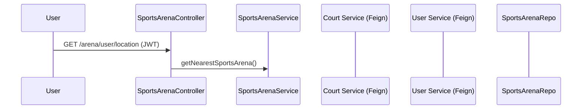

# Sports Arena Service

The **Sports Arena Service** is a Spring Boot microservice responsible for managing **sports arenas and their associated courts**. It integrates with the **Court Service** to assign and fetch courts, and with the **User Service** to get the logged-in user’s location for nearest arena recommendations.

It also uses **JWT authentication**, propagates tokens via Feign interceptors, and enforces **role-based authorization**.

---

## Features

* **Add Sports Arena** with optional courts
* **Delete Sports Arena** by ID
* **Fetch all sports arenas**
* **Fetch arena with assigned courts** (via Court Service)
* **Find nearest sports arenas** based on logged-in user’s location
* **JWT-based authentication & role-based access**
* **Feign Client integration** with:

  * **Court Service**
  * **User Service**

---

## Tech Stack

* **Java**: 17+
* **Spring Boot**: 3.x
* **Spring Security + JWT**
* **Spring Data JPA** with PostgreSQL
* **Spring Cloud OpenFeign** for inter-service communication
* **Eureka Client** for service discovery
* **Maven** for build & dependency management

---

## Getting Started

### Prerequisites

Make sure you have installed:

* Java JDK 17+
* Maven 3.8+
* PostgreSQL 14+
* Eureka Service Registry running on port `8761`
* User Service and Court Service running

### Database Setup

Create a database in PostgreSQL:

```sql
CREATE DATABASE SportsArenaDatabase;
```

Update `application.properties`:

```properties
spring.datasource.url=jdbc:postgresql://localhost:5432/SportsArenaDatabase
spring.datasource.username=postgres
spring.datasource.password=your_password
```

### Run Locally

```bash
mvn clean install
mvn spring-boot:run
```

Service runs at:
👉 [http://localhost:8081](http://localhost:8081)

---

## Security & Roles

* **Admin**:

  * Add arenas
  * Delete arenas
* **Customer**:

  * Fetch arenas
  * Find nearest arenas
* All endpoints require JWT authentication.

---

## API Endpoints

### Arena Management

* **Add Arena**

  ```http
  POST /arena/add
  ```

  **Request Body:**

  ```json
  {
    "sportsArena": {
      "name": "Arena X",
      "latitude": 12.9716,
      "longitude": 77.5946
    },
    "courts": [
      { "id": 1, "type": "Single", "price": 200.0, "isAvailable": true }
    ]
  }
  ```

* **Delete Arena**

  ```http
  DELETE /arena/delete/{arenaId}
  ```

* **Fetch All Arenas**

  ```http
  GET /arena/getAll
  ```

* **Fetch Arena with Courts**

  ```http
  GET /arena/{arenaId}
  ```

### Nearest Arena

* **Get Nearest Arenas for Logged-in User**

  ```http
  GET /arena/user/location
  ```

---

## Authentication & Token Propagation

* **JwtAuthenticationFilter** validates tokens for incoming requests.
* **FeignClientConfig** ensures JWT tokens are **propagated** to downstream services (User Service, Court Service).

---

## Architecture Flow (Sequence Diagram)


